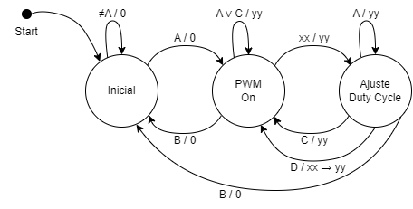
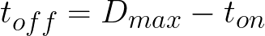
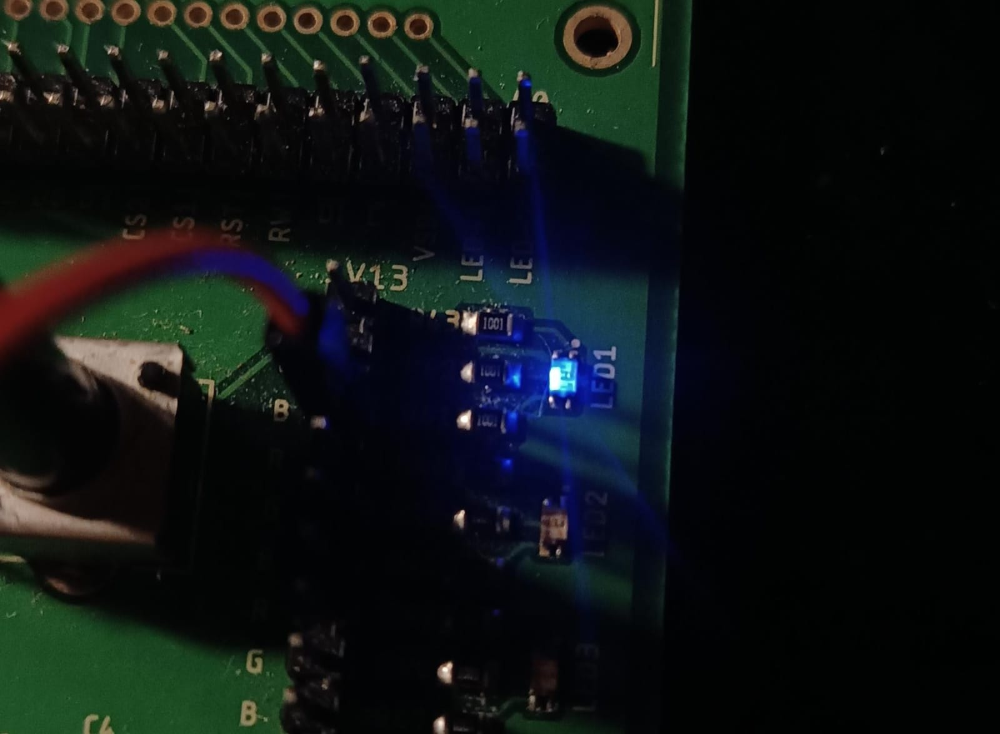
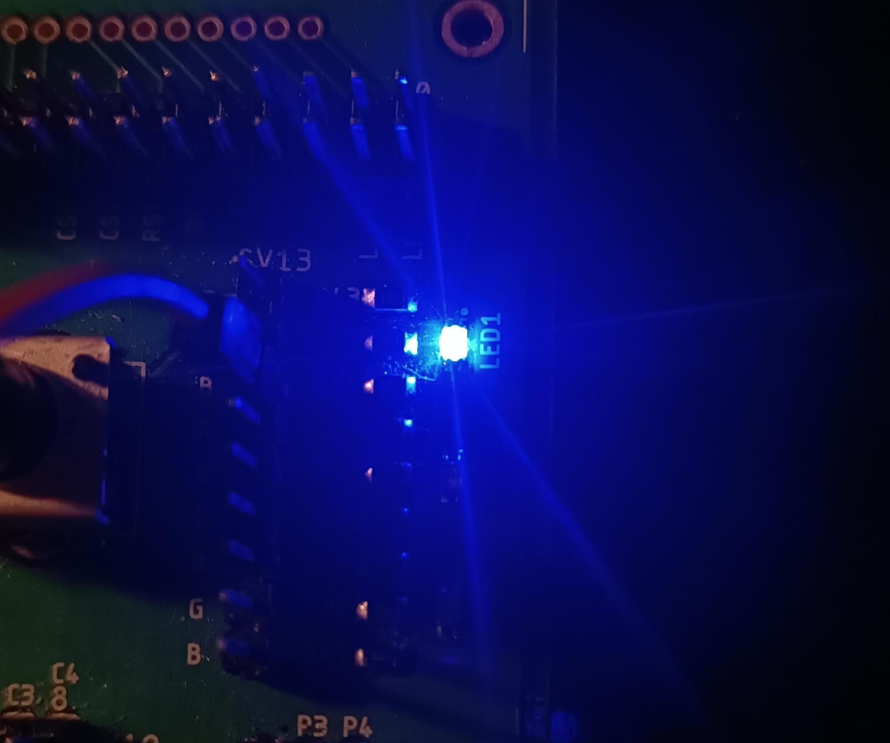

# Keyboard implementation on an ARM CORTEX-M4 Microprocessor

## States Diagram



On the _Inicial_ state, the machine is waiting to be turned in by the **A** key, and stays on the same state with any other input.

In the _PWM on_ state, the PWM is active and can vary the LED intensity by entering a two figure number which is represented with the input **xx**. **A** and **C** don't have any effect in this state, and if they are pressed the Duty Cycle remains with the saved value **yy**. With the **B** key, the PWM is turned off and the machine returns to the initial state. And with the input of the number **xx**, the machine changes to the next state and the output remains on **yy** provisionally.

In the _Ajuste Duty Cycle_ state, with the **C** key the duty cycle change is canceled and the machine returns to the previous state keeping the already saved **yy** duty cycle value. If instead the **D** key is pressed, the **xx** value is now **yy** and as such the new duty cycle is saved, the machine also returns to the previous normal operation state. On the diagram this process is represented as: (**xx -> yy**). With the **A** the machine keeps waiting for cancelation or saving. Finally, if in this state **B** is pressed, the PWM is turned off and the machine returns to the initial state.

## PWM control with a LED

The _"Led Blinky"_ example form the SDK was implemented and modified so that with a given Duty Cycle, it delivers the corresponing PWM signal to the LED

All changes were made on the main function of the _led_blinky.c_ file:

```c
int main(void)
{
    /* Board pin init */
    BOARD_InitPins();
    BOARD_InitBootClocks();

    /* Set systick reload value to generate 10 us interrupt */
    if (SysTick_Config(SystemCoreClock / 100000U))
    {
        while (1)
        {
        }
    }

    while (1)
    {
    	int DutyCycle = 1; //  0 to 99
    	int Dmax = 100U; // Maximum D = 100%

    	SysTick_DelayTicks((Dmax * DutyCycle) / 100); // On time
        GPIO_PortToggle(BOARD_LED_GPIO, 1u << BOARD_LED_GPIO_PIN);
        SysTick_DelayTicks(Dmax - (Dmax * DutyCycle) / 100); // Off time
        GPIO_PortToggle(BOARD_LED_GPIO, 1u << BOARD_LED_GPIO_PIN);
    }
}
```

- **1)** The SysTick configuration was changed so that it generates interruptions every 10 us instead of the 1ms of the example. Se cambió la configuración del SysTick para que genere interrupciones cada 10 us en vez de los 1ms del ejemplo. So that higher frequencies can be put on the delays.
- **2)** The _DutyCycle_ and _Dmax_ variables were created provisionally to vary the parameters of the PWM signal.
- **3)** The PWM is implemented the following way: First a delay with the ON time, then the LED is turned off, then there is another delay with the OFF time, and finally the LED is turned ON.
- **4)** The ON and OFF times are calculated as:




- **Operation:**


With Duty Cycle = 1

With Duty Cycle = 99

## Used pins

In the pin_mux.h file of the SDK exapmle, the pins used for the rows, columns and LED are defined. In this case all form the E port:

```c
#define BOARD_INITPINS_LED_RED_GPIO GPIOE
#define BOARD_INITPINS_LED_RED_PORT PORTE

//LED
#define BOARD_INITPINS_LED_RED_PIN 2U

//FILAS ---> SALIDAS
#define BOARD_INITPINS_FIL1_PIN 3U
#define BOARD_INITPINS_FIL2_PIN 4U
#define BOARD_INITPINS_FIL3_PIN 5U
#define BOARD_INITPINS_FIL4_PIN 6U

// COLUMNAS --> ENTRADAS
#define BOARD_INITPINS_COL1_PIN 9U
#define BOARD_INITPINS_COL2_PIN 10U
#define BOARD_INITPINS_COL3_PIN 11U
#define BOARD_INITPINS_COL4_PIN 12U
```

## Pin configuration

In the pin_mux.c file the gpio is configured, including the pullup resistors with PS and PE:

```c
void BOARD_InitPins(void)
{
    CLOCK_EnableClock(kCLOCK_PortA);
    CLOCK_EnableClock(kCLOCK_PortE);

    gpio_pin_config_t LED_RED_config = {
        .pinDirection = kGPIO_DigitalOutput,
        .outputLogic = 0U
    };

    gpio_pin_config_t Entrada_config = {
         .pinDirection = kGPIO_DigitalInput,
		 .outputLogic = 0U
    };

    // GPIO LED
    GPIO_PinInit(BOARD_INITPINS_LED_RED_GPIO, BOARD_INITPINS_LED_RED_PIN, &LED_RED_config);

    //GPIO Filas ---> Salidas
    GPIO_PinInit(BOARD_INITPINS_LED_RED_GPIO, BOARD_INITPINS_FIL1_PIN, &LED_RED_config);
    GPIO_PinInit(BOARD_INITPINS_LED_RED_GPIO, BOARD_INITPINS_FIL2_PIN, &LED_RED_config);
    GPIO_PinInit(BOARD_INITPINS_LED_RED_GPIO, BOARD_INITPINS_FIL3_PIN, &LED_RED_config);
    GPIO_PinInit(BOARD_INITPINS_LED_RED_GPIO, BOARD_INITPINS_FIL4_PIN, &LED_RED_config);

    //GPIO Columnas ---> Entradas
    GPIO_PinInit(BOARD_INITPINS_LED_RED_GPIO, BOARD_INITPINS_COL1_PIN, &Entrada_config);
    GPIO_PinInit(BOARD_INITPINS_LED_RED_GPIO, BOARD_INITPINS_COL2_PIN, &Entrada_config);
    GPIO_PinInit(BOARD_INITPINS_LED_RED_GPIO, BOARD_INITPINS_COL3_PIN, &Entrada_config);
    GPIO_PinInit(BOARD_INITPINS_LED_RED_GPIO, BOARD_INITPINS_COL4_PIN, &Entrada_config);

    /*MUX LED*/
    PORT_SetPinMux(BOARD_INITPINS_LED_RED_PORT, BOARD_INITPINS_LED_RED_PIN, kPORT_MuxAsGpio);

    //MUX Filas
    PORT_SetPinMux(BOARD_INITPINS_LED_RED_PORT, BOARD_INITPINS_FIL1_PIN, kPORT_MuxAsGpio);
    PORT_SetPinMux(BOARD_INITPINS_LED_RED_PORT, BOARD_INITPINS_FIL2_PIN, kPORT_MuxAsGpio);
    PORT_SetPinMux(BOARD_INITPINS_LED_RED_PORT, BOARD_INITPINS_FIL3_PIN, kPORT_MuxAsGpio);
    PORT_SetPinMux(BOARD_INITPINS_LED_RED_PORT, BOARD_INITPINS_FIL4_PIN, kPORT_MuxAsGpio);

    //MUX Columnas

    PORT_SetPinMux(BOARD_INITPINS_LED_RED_PORT, BOARD_INITPINS_COL1_PIN, kPORT_MuxAsGpio);
    PORT_SetPinMux(BOARD_INITPINS_LED_RED_PORT, BOARD_INITPINS_COL2_PIN, kPORT_MuxAsGpio);
    PORT_SetPinMux(BOARD_INITPINS_LED_RED_PORT, BOARD_INITPINS_COL3_PIN, kPORT_MuxAsGpio);
    PORT_SetPinMux(BOARD_INITPINS_LED_RED_PORT, BOARD_INITPINS_COL4_PIN, kPORT_MuxAsGpio);

    PORTE->PCR[9] = ((PORTE->PCR[9] &
                           (~(PORT_PCR_PS_MASK | PORT_PCR_PE_MASK | PORT_PCR_ISF_MASK)))
                          | PORT_PCR_PS(kPORT_PullUp)
						  | PORT_PCR_PE(kPORT_PullUp  ));

    PORTE->PCR[10] = ((PORTE->PCR[10] &
                               (~(PORT_PCR_PS_MASK | PORT_PCR_PE_MASK | PORT_PCR_ISF_MASK)))
                              | PORT_PCR_PS(kPORT_PullUp)
							  | PORT_PCR_PE(kPORT_PullUp  ));

    PORTE->PCR[11] = ((PORTE->PCR[11] &

                                   (~(PORT_PCR_PS_MASK | PORT_PCR_PE_MASK | PORT_PCR_ISF_MASK)))
                                  | PORT_PCR_PS(kPORT_PullUp)
								  | PORT_PCR_PE(kPORT_PullUp  ));


    PORTE->PCR[12] = ((PORTE->PCR[12] &
                                   (~(PORT_PCR_PS_MASK | PORT_PCR_PE_MASK | PORT_PCR_ISF_MASK)))
                                  | PORT_PCR_PS(kPORT_PullUp)
                                  | PORT_PCR_PE(kPORT_PullUp  ));
```

## Function to detect the keyboard

The multiplexing technique is achieved with this function, the **for** loop rotates a 0 in the rows and then the **if** checks which column is activated, depending on the row and the activated column the variables fil and col are updated, which in the state machine are used to interpret the pressed button and execute the corresponding
instruction.

```c
void Teclado(void)
{
    for (int fila = 1; fila <= 4; fila++)
    {
        // Turn off all rows
        GPIO_PortSet(BOARD_LED_GPIO, 1u << BOARD_FIL1_GPIO_PIN);
        GPIO_PortSet(BOARD_LED_GPIO, 1u << BOARD_FIL2_GPIO_PIN);
        GPIO_PortSet(BOARD_LED_GPIO, 1u << BOARD_FIL3_GPIO_PIN);
        GPIO_PortSet(BOARD_LED_GPIO, 1u << BOARD_FIL4_GPIO_PIN);

        // Activate current row
        if (fila == 1) GPIO_PortClear(BOARD_LED_GPIO, 1u << BOARD_FIL1_GPIO_PIN);
        if (fila == 2) GPIO_PortClear(BOARD_LED_GPIO, 1u << BOARD_FIL2_GPIO_PIN);
        if (fila == 3) GPIO_PortClear(BOARD_LED_GPIO, 1u << BOARD_FIL3_GPIO_PIN);
        if (fila == 4) GPIO_PortClear(BOARD_LED_GPIO, 1u << BOARD_FIL4_GPIO_PIN);

        // Reed the state of all columns
        check_col1 = GPIO_PinRead(BOARD_LED_GPIO, BOARD_COL1_GPIO_PIN);
        check_col2 = GPIO_PinRead(BOARD_LED_GPIO, BOARD_COL2_GPIO_PIN);
        check_col3 = GPIO_PinRead(BOARD_LED_GPIO, BOARD_COL3_GPIO_PIN);
        check_col4 = GPIO_PinRead(BOARD_LED_GPIO, BOARD_COL4_GPIO_PIN);

        // Update fil and col if any button is pressed
        if (check_col1 == 0 || check_col2 == 0 || check_col3 == 0 || check_col4 == 0)
        {
            if (check_col1 == 0)
            {
                col = 1;
                fil = fila;
            }
            else if (check_col2 == 0)
            {
                col = 2;
                fil = fila;
            }
            else if (check_col3 == 0)
            {
                col = 3;
                fil = fila;
            }
            else if (check_col4 == 0)
            {
                col = 4;
                fil = fila;
            }
        }
    }
}
```

## State machine and final operation

The enum variable is used to identify the states, and the Mealy state machine works within the **while** loop of the main function in the led_blinky.c file.

```c
//Variables
int col = 0, fil = 0;
int cont = 1;
int DutyCycle, Dmax, Ton, Toff;
int NUM, DEC; // Num = unidades, Dec = decenas
int check_col1, check_col2, check_col3, check_col4;

enum Estados {INICIO, PWM, DUTYCYCLE};
```

Since the machine is a Mealy type, only the keypad is checked in the state, and outputs are generated when the state changes. At the end of the states, the row and column variables are also cleared.

In the PWM state, when the input is a non-zero number, the pressed number is calculated from the row and column information as follows:

number = (row - 1) \* 3 + column

The first number is saved in the tens place and the second number in the units place. When the duty cycle data is saved, it is done as follows:

Duty Cycle = (10 \* tens) + units

From this data, the Ton and Toff are recalculated as explained in the PWM section.

Before the while loop, the START state is set so that the state machine starts there. When the next state is transitioned to for the first time, the output is the default PWM (99%).

```c
int main(void)
{
    /* Board pin init */
    BOARD_InitPins();
    BOARD_InitBootClocks();

    //Initial PWM conditions
    DutyCycle = 99; // 0 ro 99
    Dmax = 100U;    // Maximum D = 100%
    Ton = (Dmax * DutyCycle) / 100;
    Toff = Dmax - Ton;

    void pwm(void)
    {
        GPIO_PortClear(BOARD_LED_GPIO, 1u << BOARD_LED_GPIO_PIN); //Turn LED on
        SysTick_DelayTicks((Dmax * DutyCycle) / 100); // ON time
        GPIO_PortToggle(BOARD_LED_GPIO, 1u << BOARD_LED_GPIO_PIN); //Turn LED off
        SysTick_DelayTicks(Dmax - (Dmax * DutyCycle) / 100); // off time

    /* Set systick reload value to generate 10 us interrupt */
    if (SysTick_Config(SystemCoreClock / 100000U)) // iinterruption every 10 us
    {
        while (1)
        {
        }
    }

    enum Estados Estado_actual = INICIO; //Initial state

    while (1)
    {
        switch (Estado_actual) //State machine checks current state
        {
        case INICIO:
            Teclado();
            if (col == 4 && fil == 1) // A
            {
                Estado_actual = PWM;
                GPIO_PortSet(BOARD_LED_GPIO, 1u << BOARD_LED_GPIO_PIN); // Led off
            }
            else
            {
                Estado_actual = INICIO;
                GPIO_PortSet(BOARD_LED_GPIO, 1u << BOARD_LED_GPIO_PIN); // Led off
            }
            col = 0, fil = 0; // Keypad cleared
            break;

        case PWM:
            Teclado();
            if (col == 4 && fil == 2){ // B
                Estado_actual = INICIO;
                GPIO_PortSet(BOARD_LED_GPIO, 1u << BOARD_LED_GPIO_PIN); // Led off
            }
            else if (col < 4 && col != 0){ // If not letter
                if ((col == 1 || col == 3) && fil == 4){ // * or #
                    Estado_actual = PWM;
                    pwm();
                }
                else if (col == 2 && fil == 4){ // 0
                    DEC = 0;
                    col = 0;
                    fil = 0;
                    while (col == 0 && fil == 0){ //Wait for next digit
                        Teclado();
                    }
                    if (col == 2 && fil == 4){ // 0
                        NUM = 0;
                        pwm();
                        Estado_actual = DUTYCYCLE;
                    }
                    else{ //Save digit
                        NUM = (fil - 1) * 3 + col;
                        pwm();
                        Estado_actual = DUTYCYCLE;
                    }
                }
                else // != 0
                {
                    DEC = (fil - 1) * 3 + col; // Save digit on tens
                    col = 0;
                    fil = 0;
                    while (col == 0 && fil == 0){ // wait for next digit
                        Teclado();
                    }
                    if (col == 2 && fil == 4){ // 0
                        NUM = 0;
                        pwm();
                        Estado_actual = DUTYCYCLE;
                    }
                    else {
                        NUM = (fil - 1) * 3 + col; // save digit on units
                        pwm();
                        Estado_actual = DUTYCYCLE;
                    }
                }
            }
            else{ // A, C, D or nothing
                Estado_actual = PWM;
                pwm();
            }
            col = 0, fil = 0; // Clear keyboard
            break;

        case DUTYCYCLE:
            Teclado();
            if (col == 4 && fil == 2){ // B
                Estado_actual = INICIO;
                GPIO_PortSet(BOARD_LED_GPIO, 1u << BOARD_LED_GPIO_PIN); // Led off
            }
            else if (col == 4 && fil == 3){ // C
                pwm();
                Estado_actual = PWM;
            }
            else if (col == 4 && fil == 4){ // D
                DutyCycle = (DEC * 10) + NUM; // 0 to 99
                Ton = (Dmax * DutyCycle) / 100;
                Toff = Dmax - Ton;
                Estado_actual = PWM;
            }
            else{
                pwm();
                Estado_actual = DUTYCYCLE;
            }
            col = 0, fil = 0; // Clear keyboard
            break;
        }
    }
    return 0;
}
```
